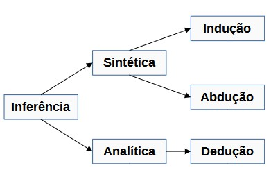
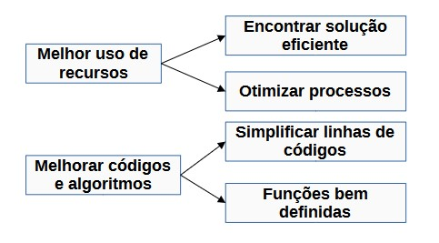
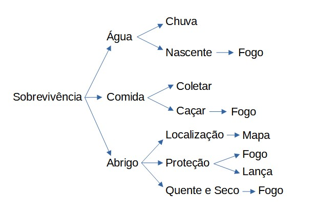

# Introdução à Programação e ao Pensamento Computacional

## 1. Pensamento Computacional

- ### Introdução

    **O que é Pensamento Computacional?**
    
    É o processo de pensamento envolvido na expressão de soluções em passos computacionais ou algoritmos que podem ser implementados no computador.
    
    É um pensamento sistemático e eficiente na formulação e resolução de problemas; também é o processo em que o humano e as máquinas sejam capazes de resolver problemas.
    
    O Quatro Pilares do Pensamento Computacional:

    - **Decomposição**: consiste em segmentar um problema complexo em problemas menores e resolvíveis;
    
    - **Reconhecimento de Padrões**: vem da ideia de identificar similaridades e tendências dentro de um mesmo contexto ou de contextos distintos;
    
    - **Abstração**: extrapolar o conceito de um problema particular para uma forma generalista;
    
    - **Design de Algoritmo**: aqui se define o passo a passo para determinar a solução de um problema.
    
- ### Habilidades Complementares

    - **Raciocínio Lógico**: é uma forma de pensamento estruturado que permite encontrar a conclusão ou determinar a resolução de um problema.
    
        \+ **Indução**: vem a partir da observação, sendo formuladas leis e teorias;
        
        \+ **Dedução**: a partir de leis e teorias se deduz previsões e explicações para determinado fenômeno;
        
        \+ **Abdução**: partindo da conclusão, se faz uma premissa.
        
         
        
        
        \+ **Aperfeiçoamento**: a partir de uma solução, determinar pontos de melhora e refinamento.
            
         Ato de aperfeiçoar:
         
         
        
        
- ### Pilares

    - #### Decomposição

    É o primeiro passo para a resolução de problemas dentro do conceito de pensamento computacional. Consiste em decompor um problema maior em problemas menores.
    
    **Estratégia**:
    
    \+ **Análise**: processo de quebrar e determinar partes menores;
        
    \+ **Síntese**: combinar os elementos, recompondo o problema original;
        
    \+ A ordem será sequencial ou paralela.
        
        
    - #### Padrões

    É um processo importante, pois torna possível generalizar para obter resoluções para problemas diferentes.
    
    **Reconhecimento de padrões**: Modelo base, estrutura variante ou repetições.
    
    
    - #### Abstração
    
    Abstrair é observar um ou mais elementos, avaliando características e propriedades em separado. Abstração é o processo intelectual de isolamento de um objeto da realidade.
    
    Generalizar é tornar-se geral, mais amplo. Generalização, na lógica, é a operação intelectual que consiste em reunir numa classe geral um conjunto de seres ou fenômenos similares.
    
    
    - #### Algoritmos
    
    Desenvolvimento do programa:
    
    \- **Análise**: estudo e definição dos dados de entrada e saída;
    
    \- **Algoritmo**: descreve o problema por meio de ferramentas;
    
    \- **Codificação**: o algoritmo é codificado de acordo com a linguagem de programação escolhida.
    
    Como construir um algoritmo:
    
    1. Compreensão dos problemas;
    
    2. definição dos dados de entrada;
    
    3. definição do processamento;
    
    4. definição dos dados de saída;
    
    5. utilização ed um método de construção;
    
    6. teste e diagnóstico.
    
    
- ### Estudo de Caso Conceitual

    Suposição: alguém está perdido na floresta.
    
    Como utilizar o pensamento computacional para maximizar a chance de sobrivivência dessa pessoa?
    
    1. Identificar mecanismos;
    
    2. Recursos comuns;
    
    3. Detalhes mais importantes.
    
    
    
    - Repetição da palavra "fogo";
    
    - Algo peculiar
    
        Mapa: ajuda a procurar comida e água, onde achar abrigo e quais são os lugares perigosos.
        
    - O mapa pode ser criado por Abstração;
    
    - Foco nos aspectos principais.
    
    
- ### Estudo de Caso Aplicado: Soma de um intervalo

    \- A soma de números entre 1 e 200:

    Temos:

    Decomposição: 200+1, 199+2, 198+3, ...

    Padrões: 200+1=201, 199+2=201, 198+3=201, ...

    Quantas vezes se repete (Repetição)? 200/2 = 100

    Resultado: 201*100 = 20100
    

   \- A soma de números entre x e y:
   
   [x, y] -> intervalo
   
   y+x = resultadoParcial
   
   (y-1)+(x+1) = resultado_parcial
   
   Total * resultadoParcial = resultado
   
   y/2 = Total
   
   **Algoritmo**:
   
   1. Recebe os valores (x e y);
   2. Resolva y/2 = Total;
   3. Resolva y+x = resultado_parcial;
   4. Ache final = total * resultado_parcial;
   5. Imprima o resultado.
   
*****

## 2. Intodução à Lógica de Programação

- **O que é lógica?**

   \- Vem para solucionar um problema;
   
   \- É uma forma estruturada de pensamento que auxilia a encontrar o que é verdadeiro ou não a partir de um contexto;
   
   \- É a organização e planejamento das instruções assertivas em um algoritmo, a fim de viabilizar a implantação de um programa.
   

- **Técnicas de Lógica de Programação**

    \- Linear: é a execução sequenciada de ações
    
    \- Estruturada: organização, disposição e ordem dos elementos essenciais que compõem um corpo;
    
    \- Modular: controle de partes independentes por um conjunto de regras.
    
- **Fundamentos de Algoritmos**

    - **Tipologia e Variáveis:**
    
        \- Tipos de dados: Numéricos, Caracteres ou Lógicos
        
    - **Variável:** é um tipo de estrutura que varia, que receberá:
    
        \- valores de ação, quando modifica o estado do algoritmo;
        
        \- valores de controle, quando é usada para controlar uma estrutura.
        
    - **Instruções Primitivas:** vão determinar as ações que serão executadas. As instruções são palavras-chave de uma determinada linguagem de programação que tem por finalidade comandar um computador que irá tratar os dados.
    
        \- Operadores: Binário ou Unário;
        
        \- Cálculos matemáticos: Variáveis ou Constantes.
        
- **Estruturas Condicionais e Operadores**
    
    Implica na existência de uma condição a ser satisfeita para executar determinada operação.
        
    \- Estrutura: simples, composta ou encadeada;
        
    \- Operadores lógicos: Verdadeiro ou Falso; e, ou e não;
        
    \- Estruturas de repetição: Condições de parada; se; fim se; fim enquanto.
        
- **Vetores e Matrizes**
    
    Um vetor é caracterizado por uma variável dimensionada com tamanho pré-fixado
    
- **O que são funções?**
    
    São blocos de instruções que realizam tarefas específicas.
    
- **Instruções de entrada/saída**
    
    Consiste na inserção e recebimento de dados do mundo real por meio de ação de alguma interface
            
    \- Saída programada;
        
    \- Saída pelos periféricos.
        
- **Linguagens de Programação**

    - Como um computador entende o programa?
    
        Código fonte: tradução e interpretação
    
    - Características de um programa:
    
        \- Desenvolvimento de Programas: Legibilidade, Redigibilidade, Confiabilidade, Custo
        
    - Análises de Código
    
        \- Análise Léxica: fazer leitura da fonte caracter por caracter; depois irá classificar e eliminar o que for necessário;
        
        \- Análise Sintática: define a corretude do programa;
        
        \- Análise Semântica: lógica do programa.
    
    